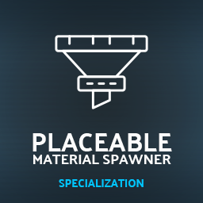

# Placeable Material Spawner

Specialization for spawning materials with placeables. This specialization enables spawning materials in one or more designated areas. It also supports pulling from ProductionPoint storage if enabled.

```
author: scfmod
url:    https://github.com/scfmod/FS22_PlaceableMaterialSpawner

If you distribute this mod, always include this info.

AND DO NOT UPLOAD IT TO MONATERY UPLOAD SERVICES.
THIS CODE IS AVAILABLE TO ANYONE FOR FREE AND YOU CAN USE
IT TO LEARN, FORK AND SPREAD THE KNOWLEDGE.
```

## How to download and install

Download the latest [```FS22_1_PlaceableMaterialSpawner.zip```](https://github.com/scfmod/FS22_PlaceableMaterialSpawner/releases/latest/download/FS22_1_PlaceableMaterialSpawner.zip) and copy/move it into your FS22 mods folder.

## Multiplayer

Multiplayer is fully supported. Only players with admin permission will be able to access the GUI control panel in-game (if applicable).

## Documentation

For implementation details and examples: [docs/INDEX.md](./docs/INDEX.md)